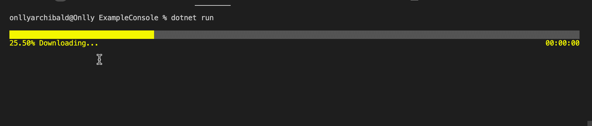

## Table of contents
- [About Retrofit.Net](#About-Retrofit.Net)
- [Support Runtime Version](#Support-Runtime-Version)
- [Installing](#Installing)
- [The Restfull with Retrofit.Net](#The-Restfull-with-Retrofit.Net)
  - [Define your Api](#Define-your-Api)
  - [Set up basic url configuration and more](#Set-up-basic-url-configuration-and-more)
    - [Send Get request](#Send-Get-request)
    - [Send Post request](#Send-Get-request)
    - [Send Put request](#Send-Get-request)
    - [Send Delete request](#Send-Get-request)
    - [Uploading multiple files to server by FormData](#Uploading-multiple-files-to-server-by-FormData)
    - [Get Response Stream](#Get-Response-Stream)
      - [Downloading file](#Downloading-file)
- [Content-type](#Content-type)
- [Retrofit.Net Configuration](#Retrofit.Net-Configuration)
- [Request Options](#request-options)
- [Response Schema](#response-schema)
- [Interceptors](#interceptors)
  - [Simple interceptor](#Simple-interceptor)
  - [Advanced interceptor](#Advanced-interceptor)
    - [Resolve and reject the request](#Resolve-and-reject-the-request)
- [Converter](#Converter)
- [Https certificate verification(not implemented...)](#https-certificate-verification)
- [Features and bugs](#features-and-bugs)

# About Retrofit.Net
🔥🔥🔥A powerful .NET Restful Http client, supports interceptor, message conversion, Get, Post, Put, Delete, file upload, file download, Proxy, Https certificate verification

# Support Runtime Version
| Target Framework  | Version |  Yes/No |
| --------          | -----:  | :----:  |
| .NET              | 6.x     |   Yes   |
| .NET              | 5.x     |   No   |
| .NET Core         | 3.x     |   No   |
| .NET Core         | 2.x     |   No   |
| .NET Standard     | 2.1     |   No   |
| .NET Standard     | 2.0     |   No   |
| .NET Standard     | 1.x     |   No   |
| .NET Framework    | All     |   No   |

# Installing
```cmd
  dotnet add package RetrofitNet
```

## The Restfull with Retrofit.Net

### Define your Api
```c#
public interface IPersonService
{
  [HttpPost("/api/Auth/GetJwtToken")]
  Response<TokenModel> GetJwtToken([FromForm] AuthModel auth);

  [HttpGet("/api/Person")]
  Response<IList<Person>> Get();

  [HttpPost("/api/Person")]
  Response<Person> Add([FromBody] Person person);

  [HttpGet("/api/Person/{id}")]
  Response<Person> Get([FromPath] int id);

  [HttpPut("/api/Person/{id}")]
  Response<Person> Update([FromPath] int id, [FromBody] Person person);

  [HttpDelete("/api/Person/{id}")]
  Response<Person> Delete([FromPath] int id);
        
  [HttpGet("https://www.baidu.com/index.html")]
  Response<dynamic> GetBaiduHome();
}
```
### Set up basic url configuration and more
```c#
using Retrofit.Net.Core;
using Retrofit.Net.Core.Models;

var client = new RetrofitClient.Builder()
    .AddInterceptor(new HeaderInterceptor())
    .Build();
var retrofit = new Retrofit.Net.Core.Retrofit.Builder()
    .AddBaseUrl("https://localhost:7177")
    .AddClient(client)
    .Build();
var service = retrofit.Create<IPersonService>();
Response<TokenModel> authResponse = service.GetJwtToken(new AuthModel() { Account = "admin", Password = "admin" });
```
### Send Get request
```c#
Response<IList<Person>> response = await service.Get();
Console.WriteLine(JsonConvert.SerializeObject(response));
```
### Send Post request
```c#
Response<Person> response = await service.Add(new Person { Id = 1,Name = "老中医",Age = 18});
Console.WriteLine(JsonConvert.SerializeObject(response));
```
### Send Put request
```c#
var response = service.Update(1, new Person() { Name = "Charlie" });
```
### Send Delete request
```c#
var response = service.Delete(1);
```
### Uploading multiple files to server by FormData
SubmitEntity.cs
```c#
public class SubmitEntity
{
    public string Name { get; set; }
    public FieldFile File { get; set; }
    // You can upload multiple files including parameters like this
    // public FieldFile File2 { get; set; }
    // for more File3,File4...
}
```
upload
```c#
var response = service.Submit(new SubmitEntity{ 
        Name = "老中医",
        File = new FieldFile{ FilePath = "/Users/onllyarchibald/Downloads/icon_unlocked.png" }
    });
Console.WriteLine(JsonConvert.SerializeObject(response));
```
…you can find more examples code [here](https://github.com/mingyouzhu/Retrofit.Net/tree/6036e67de00603a9189401c6a228e651be15205e/example/ExampleConsole).

### Get Response Stream
Define your api:
```c#
[HttpGetStream("/WeatherForecast/Download")]
Task<Response<Stream>> Download([FromQuery]string arg1);
```
Example:
```c#
Response<Stream> response = await service.Download("test");
```

### Downloading file
After getting the http reactive stream, you can store it,like this:
```c#
Response<Stream> response = await service.Download("test");
Stream outStream = File.Create("/Users/onllyarchibald/Desktop/a.zip");
byte[] buffer = new byte[1024];
int i;
do{
    i = response.Body!.Read(buffer,0,buffer.Length);
    if(i > 0)outStream.Write(buffer,0,i);
}while(i > 0);
outStream.Close();
response.Body.Close();
Console.WriteLine("File download completed...");
```


…you can find more examples code [here](https://github.com/mingyouzhu/Retrofit.Net/commit/0804be858f8607e7fab404fbee2e9861430b579b).

## Content-type
```js
application/json    -> [FromBody]
multipart/form-data -> [FromForm]
```

## Retrofit.Net Configuration
Here you can configure 'interceptor', 'timeout', 'response' converter. like this:
```c#
var client = new RetrofitClient.Builder()
    .AddInterceptor(new HeaderInterceptor())     // Add Interceptor
    .AddInterceptor(new SimpleInterceptorDemo()) // ...
    .AddTimeout(TimeSpan.FromSeconds(10)) // The default wait time after making an http request is 6 seconds
    .Build();
var retrofit = new Retrofit.Net.Core.Retrofit.Builder()
    .AddBaseUrl("https://localhost:7283") // Base Url
    .AddClient(client)
    .AddConverter(new DefaultXmlConverter()) // The internal default is ‘DefaultJsonConverter’ if you don’t call ‘.AddConverter(new DefaultJsonConverter())’
    .Build();
```
you can find more examples code [here]().

## Response Schema

The response for a request contains the following information.

```c#
public class Response<T>
{
   // Http message
   public string? Message { get; internal set; }
   // Response body. may have been transformed, please refer to Retrofit.Builder.AddConverterFactory(...).
   public T? Body { get; internal set; }
   // Http status code.
   public int StatusCode { get; internal set; }
   // Response headers.
   public IEnumerable<KeyValuePair<string, object>>? Headers { get; internal set; }
}
```

When request is succeed, you will receive the response as follows:

```c#
Response<IList<Person>> response = await service.Get();
Console.WriteLine(response.Body);
Console.WriteLine(response.Message);
Console.WriteLine(response.StatusCode);
Console.WriteLine(response.Headers);
```

# Interceptors

For each http request, We can add one or more interceptors, by which we can intercept requests 、 responses and errors.

```c#
... RetrofitClient.Builder()
    .AddInterceptor(new YourCustomInterceptor())
    .Build();
```

## Simple interceptor:
```c#
public class SimpleInterceptorDemo : ISimpleInterceptor
{
    public void OnRequest(Request request)
    {
        Debug.WriteLine($"REQUEST[{request.Method}] => PATH: {request.Path}");
    }

    public void OnResponse(Response<dynamic> response)
    {
        Debug.WriteLine($"RESPONSE[{response.StatusCode}] => Message: {response.Message}");
    }
}
```

## Advanced interceptor
Advanced interceptors can be implemented by inheriting the IAdvancedInterceptor interface. Then I will tell you through an example of token renewal
```c#
public class HeaderInterceptor : IAdvancedInterceptor
{
    public Response<dynamic> Intercept(IChain chain)
    {
        // Get token from local file system
        string? token = null;
        if(File.Exists("token.txt"))token = File.ReadAllText("token.txt");

        // Add token above
        Request request = chain.Request().NewBuilder()
            .AddHeader("Authorization", $"Bearer {token}")
            .Build();

        Response<dynamic> response = chain.Proceed(request);
        if(response.StatusCode == 401)
        {
            // Get a new token and return
            // The way to get the new token here depends on you,
            // you can ask the backend to write an API to refresh the token
            request = chain.Request().NewBuilder()
                .AddHeader("Authorization", $"Bearer <new token>")
                .Build();
            // relaunch!
            response = chain.Proceed(request);
        }
        return response;
    }
}
```

## Resolve and reject the request
In all interceptors, you can interfere with their execution flow. If you want to resolve the request/response with some custom data，you can call `return new Response<dynamic>();`. 
```c#
public Response<dynamic> Intercept(IChain chain)
{
    return new Response<dynamic>();
}
```

## Converter
`Converter` allows the request/response data to be changed before it is sent/received to the server. I have implemented a `DefaultXmlConverter` and `DefaultJsonConverter` as the default converter. If you want to customize the conversion of request/response data, you can define a class that inherits'IConverter' and replace `DefaultJsonConverter` by setting `.AddConverter(new YourCustomConverter())`. 
```c#
public class DefaultJsonConverter : IConverter
{
    // value:        Data returned from the server
    // type:         The return type of the interface you declared
    // return value: What type do you want to convert to? Here is to convert the json returned by the server /// to the interface return type you defined
    public object? OnConvert(string from, Type to)
    {
        if(from is null)return from;
        if (to == typeof(Stream))return from;
        if (to?.Namespace?.StartsWith("System") is not true)
        {
            return JsonConvert.DeserializeObject(from.ToString() ?? "",to!);
        }
        return from;
    }
}
````
you can find more examples code [here](https://github.com/mingyouzhu/Retrofit.Net/blob/b2eda7657283e518ae76c101cd9b8cbd1365b463/example/ExampleConsole/Program.cs).

## Https certificate verification


## Copyright & License

This open source project authorized by https://github.com, and the license is MIT.

## Features and bugs

Please file feature requests and bugs at the [issue tracker][tracker].

[tracker]: https://github.com/mingyouzhu/Retrofit.Net/issues

## Donate
Buy a cup of coffee for me (Scan by wechat)：


