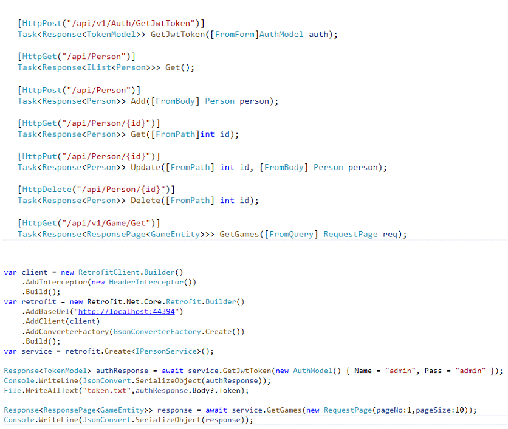



## Table of contents
- [About Retrofit.Net](#About-Retrofit.Net)
- [Support Runtime Version](#Support-Runtime-Version)
- [Installing](#Installing)
- [The Restfull with Retrofit.Net](#The-Restfull-with-Retrofit.Net)
- [Retrofit.Net APIs](#Retrofit.Net-APIs)
- [Request Options](#request-options)
- [Response Schema](#response-schema)
- [Interceptors](#interceptors)
  - [Simple interceptor](#Simple-interceptor)
  - [Resolve and reject the request](#Resolve-and-reject-the-request)
  - [Log Interceptor](#Log-Interceptor)
  - [Advanced interceptor](#Advanced-interceptor)
- [Cookie Manager](#cookie-manager)
- [Handling Errors](#handling-errors)
- [Using application/x-www-form-urlencoded format](#using-applicationx-www-form-urlencoded-format)
- [Sending FormData](#sending-formdata)
- [Transformer](#Transformer)
- [Set proxy and HttpClient config](#set-proxy-and-httpclient-config)
- [Https certificate verification](#https-certificate-verification)
- [Http2 support](#http2-support )
- [Features and bugs](#features-and-bugs)

# About Retrofit.Net
🔥🔥🔥A powerful Http client for .NET, which supports Interceptors, Global configuration, FormData, Request Cancellation, File downloading, Timeout etc. 

# Support Runtime Version
| Target Framework  | Version |  Yes/No |
| --------          | -----:  | :----:  |
| .NET              | 6.x     |   Yes   |
| .NET              | 5.x     |   No   |
| .NET Core         | 3.x     |   No   |
| .NET Core         | 2.x     |   No   |
| .NET Standard     | 2.1     |   No   |
| .NET Standard     | 2.0     |   No   |
| .NET Standard     | 1.x     |   No   |
| .NET Framework    | All     |   No   |

# Installing
```cmd
  dotnet add package RetrofitNet
```

## The Restfull with Retrofit.Net

Define your request api in IPersonService.cs
```c#
public interface IPersonService
{
  [HttpPost("/api/Auth/GetJwtToken")]
  Response<TokenModel> GetJwtToken([FromForm] AuthModel auth);

  [HttpGet("/api/Person")]
  Response<IList<Person>> Get();

  [HttpPost("/api/Person")]
  Response<Person> Add([FromBody] Person person);

  [HttpGet("/api/Person/{id}")]
  Response<Person> Get([FromPath] int id);

  [HttpPut("/api/Person/{id}")]
  Response<Person> Update([FromPath] int id, [FromBody] Person person);

  [HttpDelete("/api/Person/{id}")]
  Response<Person> Delete([FromPath] int id);
        
  [HttpGet("https://www.baidu.com/index.html")]
  Response<dynamic> GetBaiduHome();
}
```

```c#
using Retrofit.Net.Core;
using Retrofit.Net.Core.Models;

var client = new RetrofitClient.Builder()
    .AddInterceptor(new HeaderInterceptor())
    .Build();
var retrofit = new Retrofit.Net.Core.Retrofit.Builder()
    .AddBaseUrl("https://localhost:7177")
    .AddClient(client)
    .AddConverterFactory(GsonConverterFactory.Create())
    .Build();
var service = retrofit.Create<IPersonService>();
Response<TokenModel> authResponse = service.GetJwtToken(new AuthModel() { Account = "admin", Password = "admin" });
```

Performing a `GET` request:

```c#
Response<IList<Person>> response = await service.Get();
Console.WriteLine(JsonConvert.SerializeObject(response));
```

Performing a `POST` request:

```c#
Response<Person> response = await service.Add(new Person { Id = 1,Name = "老中医",Age = 18});
Console.WriteLine(JsonConvert.SerializeObject(response));
```

Downloading a file:

```dart
not implemented
```

Sending FormData:

```c#
Response<TokenModel> authResponse = await service.GetJwtToken(new AuthModel() { Account = "admin",Password = "admin" });
Console.WriteLine(JsonConvert.SerializeObject(authResponse));
```

Uploading multiple files to server by FormData:

```c#
not implemented
```

Listening the uploading progress:

```c#
not implemented
```

…you can find all examples code [here](https://github.com/mingyouzhu/Retrofit.Net/tree/master/example/ExampleConsole).


## Retrofit.Net APIs

### Creating an instance and set default configs.

You can create instance of Retrofit with an optional `Retrofit.Builder` object:

```c#
var client = new RetrofitClient.Builder()
    .AddInterceptor(new HeaderInterceptor()) // Add Interceptor
    .Build();
var retrofit = new Retrofit.Net.Core.Retrofit.Builder()
    .AddBaseUrl("https://localhost:7177")  // Server address
    .AddClient(client)
    .AddConverterFactory(GsonConverterFactory.Create()) // Message Content Converter
    .Build();
```

## Response Schema

The response for a request contains the following information.

```c#
public class Response<T>
{
   // Http message
   public string? Message { get; internal set; }
   // Response body. may have been transformed, please refer to Retrofit.Builder.AddConverterFactory(...).
   public T? Body { get; internal set; }
   // Http status code.
   public int StatusCode { get; internal set; }
   // Response headers.
   public IEnumerable<KeyValuePair<string, object>>? Headers { get; internal set; }
}
```

When request is succeed, you will receive the response as follows:

```c#
Response<IList<Person>> response = await service.Get();
Console.WriteLine(response.Body);
Console.WriteLine(response.Message);
Console.WriteLine(response.StatusCode);
Console.WriteLine(response.Headers);
```

## Interceptors

For each dio instance, We can add one or more interceptors, by which we can intercept requests 、 responses and errors before they are handled by `then` or `catchError`.

```dart
dio.interceptors.add(InterceptorsWrapper(
    onRequest:(options, handler){
     // Do something before request is sent
     return handler.next(options); //continue
     // If you want to resolve the request with some custom data，
     // you can resolve a `Response` object eg: `handler.resolve(response)`.
     // If you want to reject the request with a error message,
     // you can reject a `DioError` object eg: `handler.reject(dioError)`
    },
    onResponse:(response,handler) {
     // Do something with response data
     return handler.next(response); // continue
     // If you want to reject the request with a error message,
     // you can reject a `DioError` object eg: `handler.reject(dioError)` 
    },
    onError: (DioError e, handler) {
     // Do something with response error
     return  handler.next(e);//continue
     // If you want to resolve the request with some custom data，
     // you can resolve a `Response` object eg: `handler.resolve(response)`.  
    }
));
```

### Simple interceptor:

```dart
import 'package:dio/dio.dart';
class CustomInterceptors extends Interceptor {
  @override
  void onRequest(RequestOptions options, RequestInterceptorHandler handler) {
    print('REQUEST[${options.method}] => PATH: ${options.path}');
    return super.onRequest(options, handler);
  }
  @override
  void onResponse(Response response, ResponseInterceptorHandler handler) {
    print('RESPONSE[${response.statusCode}] => PATH: ${response.requestOptions.path}');
    super.onResponse(response, handler);
  }
  @override
  Future onError(DioError err, ErrorInterceptorHandler handler) {
    print('ERROR[${err.response?.statusCode}] => PATH: ${err.requestOptions.path}');
    return super.onError(err, handler);
  }
}
```

### Resolve and reject the request

In all interceptors, you can interfere with their execution flow. If you want to resolve the request/response with some custom data，you can call `handler.resolve(Response)`.  If you want to reject the request/response with a error message, you can call `handler.reject(dioError)` .

```dart
dio.interceptors.add(InterceptorsWrapper(
  onRequest:(options, handler) {
   return handler.resolve(Response(requestOptions:options,data:'fake data'));
  },
));
Response response = await dio.get('/test');
print(response.data);//'fake data'
```

#### Example

Because of security reasons, we need all the requests to set up a csrfToken in the header, if csrfToken does not exist, we need to request a csrfToken first, and then perform the network request, because the request csrfToken progress is asynchronous, so we need to execute this async request in request interceptor. The code is as follows:

```dart
  var dio = Dio();
  //  dio instance to request token
  var tokenDio = Dio();
  String? csrfToken;
  dio.options.baseUrl = 'http://www.dtworkroom.com/doris/1/2.0.0/';
  tokenDio.options = dio.options;
  dio.interceptors.add(QueuedInterceptorsWrapper(
    onRequest: (options, handler) {
      print('send request：path:${options.path}，baseURL:${options.baseUrl}');
      if (csrfToken == null) {
        print('no token，request token firstly...');
        tokenDio.get('/token').then((d) {
          options.headers['csrfToken'] = csrfToken = d.data['data']['token'];
          print('request token succeed, value: ' + d.data['data']['token']);
          print(
              'continue to perform request：path:${options.path}，baseURL:${options.path}');
          handler.next(options);
        }).catchError((error, stackTrace) {
          handler.reject(error, true);
        });
      } else {
        options.headers['csrfToken'] = csrfToken;
        return handler.next(options);
      }
    },
   ); 
```

### Log Interceptor

You can set  `LogInterceptor` to  print request/response log automaticlly, for example:

```dart
dio.interceptors.add(LogInterceptor(responseBody: false)); //开启请求日志
```

### Advanced interceptor

You can custom interceptor by extending the `Interceptor/QueuedInterceptor` class. There is an example that implementing a simple cache policy.


## Cookie Manager

[dio_cookie_manager](https://github.com/flutterchina/dio/tree/master/plugins/cookie_manager) package is a cookie manager for Dio.  

## Handling Errors

When a error occurs, Dio will wrap the `Error/Exception` to a `DioError`:

```dart
try {
  //404
  await dio.get('https://wendux.github.io/xsddddd');
} on DioError catch (e) {
  // The request was made and the server responded with a status code
  // that falls out of the range of 2xx and is also not 304.
  if (e.response != null) {
    print(e.response.data)
    print(e.response.headers)
    print(e.response.requestOptions)
  } else {
    // Something happened in setting up or sending the request that triggered an Error
    print(e.requestOptions)
    print(e.message)
  }
}
```

### DioError scheme

```dart
 {
  /// Response info, it may be `null` if the request can't reach to
  /// the http server, for example, occurring a dns error, network is not available.
  Response? response;
  /// Request info.
  RequestOptions? request;
  /// Error descriptions.
  String message;
  DioErrorType type;
  /// The original error/exception object; It's usually not null when `type`
  /// is DioErrorType.DEFAULT
  dynamic? error;
}
```

### DioErrorType

```dart
enum DioErrorType {
  /// It occurs when url is opened timeout.
  connectTimeout,
  /// It occurs when url is sent timeout.
  sendTimeout,
  ///It occurs when receiving timeout.
  receiveTimeout,
  /// When the server response, but with a incorrect status, such as 404, 503...
  response,
  /// When the request is cancelled, dio will throw a error with this type.
  cancel,
  /// Default error type, Some other Error. In this case, you can
  /// use the DioError.error if it is not null.
  other,
}
```

## Using application/x-www-form-urlencoded format

By default, Dio serializes request data(except String type) to `JSON`. To send data in the `application/x-www-form-urlencoded` format instead, you can :

```dart
//Instance level
dio.options.contentType= Headers.formUrlEncodedContentType;
//or works once
dio.post(
  '/info',
  data: {'id': 5},
  options: Options(contentType: Headers.formUrlEncodedContentType),
);
```

## Sending FormData

You can also send FormData with Dio, which will send data in the `multipart/form-data`, and it supports uploading files.

```dart
var formData = FormData.fromMap({
  'name': 'wendux',
  'age': 25,
  'file': await MultipartFile.fromFile('./text.txt',filename: 'upload.txt')
});
response = await dio.post('/info', data: formData);
```

There is a complete example [here](https://github.com/flutterchina/dio/blob/master/example/formdata.dart).

### Multiple files upload

There are two ways to add multiple files to ` FormData`， the only difference is that upload keys are different for array types。

```dart
FormData.fromMap({
  'files': [
    MultipartFile.fromFileSync('./example/upload.txt', filename: 'upload.txt'),
    MultipartFile.fromFileSync('./example/upload.txt', filename: 'upload.txt'),
  ]
});
```

The upload key eventually becomes 'files[]'，This is because many back-end services add a middle bracket to key when they get an array of files. **If you don't want “[]”**，you should create FormData as follows（Don't use `FormData.fromMap`）:

```dart
var formData = FormData();
formData.files.addAll([
  MapEntry('files',
    MultipartFile.fromFileSync('./example/upload.txt',filename: 'upload.txt'),
  ),
  MapEntry('files',
    MultipartFile.fromFileSync('./example/upload.txt',filename: 'upload.txt'),
  ),
]);
```

## Transformer

`Transformer` allows changes to the request/response data before it is sent/received to/from the server. This is only applicable for request methods 'PUT', 'POST', and 'PATCH'. Dio has already implemented a `DefaultTransformer`, and as the default `Transformer`. If you want to customize the transformation of request/response data, you can provide a `Transformer` by your self, and replace the `DefaultTransformer` by setting the `dio.transformer`.

### In flutter

If you use dio in flutter development, you'd better to decode json   in background with [compute] function.

```dart
// Must be top-level function
_parseAndDecode(String response) {
  return jsonDecode(response);
}
parseJson(String text) {
  return compute(_parseAndDecode, text);
}
void main() {
  ...
  //Custom jsonDecodeCallback
  (dio.transformer as DefaultTransformer).jsonDecodeCallback = parseJson;
  runApp(MyApp());
}
```

### Other Example

There is an example for [customizing Transformer](https://github.com/flutterchina/dio/blob/master/example/transfomer.dart).

[Here](https://github.com/flutterchina/dio/blob/master/example/adapter.dart) is a simple example to custom adapter. 

### Using proxy

`DefaultHttpClientAdapter` provide a callback to set proxy to `dart:io:HttpClient`, for example:

```dart
import 'package:dio/dio.dart';
import 'package:dio/adapter.dart';
...
(dio.httpClientAdapter as DefaultHttpClientAdapter).onHttpClientCreate = (client) {
  // config the http client
  client.findProxy = (uri) {
    //proxy all request to localhost:8888
    return 'PROXY localhost:8888';
  };
  // you can also create a new HttpClient to dio
  // return HttpClient();
};
```

There is a complete example [here](https://github.com/flutterchina/dio/blob/master/example/proxy.dart).

### Https certificate verification

There are two ways  to verify the https certificate. Suppose the certificate format is PEM, the code like:

```dart
String PEM='XXXXX'; // certificate content
(dio.httpClientAdapter as DefaultHttpClientAdapter).onHttpClientCreate  = (client) {
  client.badCertificateCallback=(X509Certificate cert, String host, int port){
    if(cert.pem==PEM){ // Verify the certificate
      return true;
    }
    return false;
  };
};
```

Another way is creating a `SecurityContext` when create the `HttpClient`:

```dart
(dio.httpClientAdapter as DefaultHttpClientAdapter).onHttpClientCreate  = (client) {
  SecurityContext sc = SecurityContext();
  //file is the path of certificate
  sc.setTrustedCertificates(file);
  HttpClient httpClient = HttpClient(context: sc);
  return httpClient;
};
```

In this way,  the format of certificate must be PEM or PKCS12.

## Http2 support

[dio_http2_adapter](https://github.com/flutterchina/dio/tree/master/plugins/http2_adapter) package is a Dio HttpClientAdapter which support Http/2.0 .

## Copyright & License

This open source project authorized by https://github.com, and the license is MIT.

## Features and bugs

Please file feature requests and bugs at the [issue tracker][tracker].

[tracker]: https://github.com/mingyouzhu/Retrofit.Net/issues

## Donate

Buy a cup of coffee for me (Scan by wechat)：


